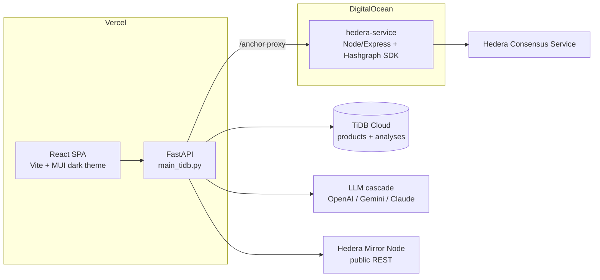

# ◆ VeriChainX — AI counterfeit detection, verified on Hedera

[](https://verichain-x-hedera.vercel.app)
[](https://opensource.org/licenses/MIT)
[](https://www.python.org/downloads/)
[](https://react.dev)

VeriChainX analyzes product listings with multi-agent AI, scores their authenticity, and anchors every verdict to the **Hedera Consensus Service** — so anyone can verify a product without an account, and nobody (including us) can rewrite the verdict afterwards.

**Try it live:**

| Surface | URL |
|---|---|
| App + landing | https://verichain-x-hedera.vercel.app |
| Operations dashboard | https://verichain-x-hedera.vercel.app/admin |
| Example public record | https://verichain-x-hedera.vercel.app/verify/390002 |
| Example certificate | https://verichain-x-hedera.vercel.app/certificate/390002 |
| Example share card (OG image) | https://verichain-x-hedera.vercel.app/api/v1/og/390002.png |
| API docs | https://verichain-x-hedera.vercel.app/docs |

## The consumer flow

1. **Analyze** — submit a product (name, description, price, category) in the dashboard. A multi-provider LLM cascade (OpenAI → Gemini → Claude → heuristics) scores authenticity and explains its evidence.
2. **Anchor** — one click submits the verdict to a Hedera Consensus Service topic via the hedera-service. Immutable, timestamped, publicly auditable.
3. **Verify** — every product gets a public passport page at `/verify/:id`: animated trust score, the AI's reasoning, a provenance timeline, and a HashScan deep link to the on-chain proof. No login. Mobile-first, because the entry point is a **QR code** printed on a label.
4. **Share** — share links (`/s/:id`) unfurl into branded verdict cards in Slack/X/WhatsApp (server-rendered OG images). Authentic products get a printable **Certificate of Authenticity**; flagged ones get a **Counterfeit Verification Report** a buyer can attach to a refund or takedown claim.

## Architecture



- **Frontend** (`src/`, entry `main.tsx`): React 19 + MUI, three public routes (`/`, `/verify/:id`, `/certificate/:id`) plus the `/admin` dashboard (analyze, results, agent monitor, live Hedera panel).
- **API** (`main_tidb.py`): FastAPI on Vercel Python. AI analysis, TiDB persistence, public record endpoints, OG card rendering (Pillow), and real network data from the public Hedera Mirror Node with HashScan links.
- **hedera-service** (`hedera-service/`): the only component holding Hedera operator keys. Creates/reuses an HCS topic and submits verdict messages (`POST /api/v1/hedera/anchor`).

## Key API endpoints

```http
POST /api/v1/products/analyze      # AI verdict + TiDB persistence
GET  /api/v1/products              # recent analyses
GET  /api/v1/products/{id}         # public record (powers /verify/:id)
POST /api/v1/hedera/anchor         # anchor a verdict to HCS (proxies hedera-service)
GET  /api/v1/hedera/transactions   # real testnet txs w/ HashScan links
GET  /api/v1/hedera/network        # live supply + node count (Mirror Node)
GET  /api/v1/og/{id}.png           # 1200x630 verdict card (OG image)
GET  /s/{id}                       # share shim: OG meta for crawlers, redirect for humans
GET  /api/v1/analytics/dashboard   # aggregate stats
```

## Running locally

```bash
git clone https://github.com/ZubeidHendricks/verichainX-hedera.git
cd verichainX-hedera

# Frontend (Vite dev server)
npm install
npm run dev

# API (needs Python 3.12 + TiDB credentials)
pip install -r requirements.txt
uvicorn main_tidb:app --reload --port 8000

# hedera-service (needs Hedera testnet operator credentials)
cd hedera-service && npm install && npm run dev
```

### Environment variables

| Component | Variable | Purpose |
|---|---|---|
| API | `TIDB_HOST` / `TIDB_PORT` / `TIDB_USER` / `TIDB_PASSWORD` / `TIDB_DATABASE` | TiDB Cloud connection (required) |
| API | `OPENAI_API_KEY` (+ optional `GEMINI_API_KEY`, `GROQ_API_KEY`) | LLM cascade |
| API | `HEDERA_NETWORK` | `testnet` (default) or `mainnet` |
| API | `HEDERA_SERVICE_URL` | Deployed hedera-service base URL (enables anchoring) |
| API | `PUBLIC_BASE_URL` | Canonical URL used in share links / QR codes |
| hedera-service | `HEDERA_ACCOUNT_ID` / `HEDERA_PRIVATE_KEY` | Testnet operator (get one at [portal.hedera.com](https://portal.hedera.com)) |
| hedera-service | `HEDERA_TOPIC_ID` | Optional: reuse one HCS topic instead of creating on first anchor |
| Frontend | `VITE_API_BASE_URL` | API origin (defaults to production) |

## Deployment

- **Vercel** (frontend + API): push to `main` — the Git integration builds and promotes automatically. `vercel.json` defines the static build, the Python function, and routing. Note: do **not** add a `pyproject.toml` without a `[project]` table; Vercel's uv-based Python builder fails on it.
- **DigitalOcean App Platform** (hedera-service): deploys `/hedera-service` on push to `main`.

## Repo layout notes

The shipped product is the SPA + `main_tidb.py` + `hedera-service/`. The `src/counterfeit_detection/` tree is an earlier, more ambitious multi-agent Python system (vector search, zk-proof experiments, enforcement workflows) that is **not** wired into the deployed app — kept for reference. Its dev-tool config lives in `pytest.ini` / `mypy.ini` / `.isort.cfg`.

## License

MIT — see [LICENSE](LICENSE).

---

**Built for the Hedera ecosystem** — every verdict one click from independent verification on [HashScan](https://hashscan.io/testnet).
